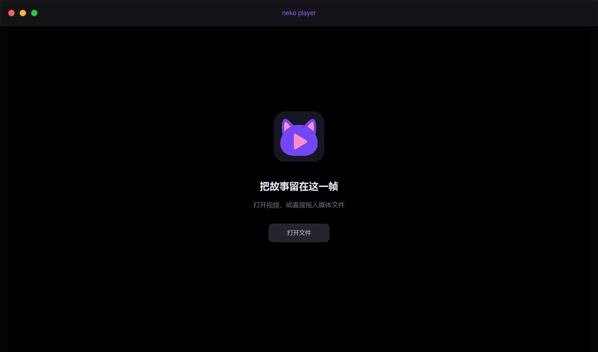

# neko player

[简体中文](README.md) | [English](README_EN.md)

[](https://github.com/Yuel25/neko-player/actions/workflows/build.yml)

A modern Windows media player built with Rust, Slint, and libmpv.


## Screenshots

### Home



### Video Playback


## Features

- Hardware-accelerated playback through the libmpv Render API
- Playlist support: drag or add multiple files, select tracks, remove individual entries, and choose sequential, repeat-all, repeat-one, or shuffle playback with automatic advancement
- Remembers volume, mute, playback speed, loop mode, playlist, and window placement; prompts to resume when the same file is opened again
- Drop files anywhere in the window to play them; dropped files start immediately when the playlist is empty and are appended when a playlist already exists
- Borderless dark interface with Windows 11 rounded corners and macOS-style window controls
- Play, pause, timeline seeking, 10-second skips, and previous-track behavior that restarts the current file first when more than three seconds have played
- Hover thumbnails on the progress bar with asynchronous, time-bucketed caching
- Frame-by-frame navigation with `-1` and `+1`
- Volume, mute, playback speed, audio-track, and subtitle-track controls; volume amplification up to 200%, with an amber indicator above 100%
- Synchronized same-name LRC lyrics with UTF-8, UTF-16, CP932, and CP936 support
- Save the current video frame as a PNG image
- Fullscreen mode, keyboard shortcuts, and an auto-hiding control bar

Settings are stored in `%APPDATA%\neko-player\config.json`. Delete this file to reset all remembered state.

## Keyboard Shortcuts

| Key | Action |
|---|---|
| `Space` | Play / pause |
| `←` / `→` | Seek backward / forward 5 seconds |
| `↑` / `↓` | Adjust volume |
| `N` / `P` | Next / previous track |
| `L` | Show / hide the playlist |
| `M` | Mute |
| `F` | Fullscreen |
| `Esc` | Exit fullscreen |

## LRC Lyrics

Place the lyrics file next to the audio file and give it the same base name:

```text
song.flac
song.lrc
```

## System Requirements

- Windows 10/11 x64
- A graphics driver supporting OpenGL ES 3.x

After downloading the Release archive, keep `neko-player.exe` and `libmpv-2.dll` in the same directory.

Alternatively, install the app with `neko-player-setup-1.0.0.exe`. The installer supports common audio and video file associations, registers neko player as a candidate under Windows Settings → Default Apps, and adds “Open with neko player” to File Explorer's context menu.

## Building from Source

The Rust MSVC toolchain and a libmpv development package are required.

1. Download `mpv-dev-x86_64` from [zhongfly/mpv-winbuild](https://github.com/zhongfly/mpv-winbuild/releases).
2. Place the headers, DLL, and generated MSVC import library under `third_party/mpv/`:

   ```text
   third_party/mpv/include/mpv/*.h
   third_party/mpv/libmpv-2.dll
   third_party/mpv/libmpv-2.lib
   ```

3. Build:

   ```powershell
   cargo build --release
   ```

4. Run:

   ```powershell
   cargo run --release -- "path/to/video.mp4"
   ```

`build.rs` automatically copies `libmpv-2.dll` into the output directory.

## Building the Installer

Install [Inno Setup 6](https://jrsoftware.org/isinfo.php), complete a Release build, and run:

```powershell
iscc installer\neko-player.iss
```

The installer is written to `dist\`. Local builds use the script's default `MyAppVersion`; GitHub Actions overrides it with the version from `Cargo.toml`.

## Continuous Integration

On pushes to `main` and pull requests, [GitHub Actions](.github/workflows/build.yml) downloads the mpv development package, generates the MSVC import library, performs a Release build, packages the ZIP archive, and compiles the Inno Setup installer. Pushing a `v*` tag automatically creates a GitHub Release and uploads both artifacts.

If the repository secrets `CERTIFICATE_BASE64` (the base64-encoded Authenticode PFX certificate) and `CERTIFICATE_PASSWORD` are configured, CI signs the executable and installer with signtool. Signing is skipped automatically when the secrets are absent.

## Architecture

- Rust 2021
- Slint 1.17
- libmpv client/render API
- glow with OpenGL ES
- Win32 borderless-window integration

Core module responsibilities:

- `src/main.rs`: application startup, OpenGL wiring, UI callbacks, and lifecycle orchestration
- `src/app_support.rs`: UI synchronization, display formatting, file dialogs, and exit-state snapshots
- `src/player.rs`: libmpv state, commands, events, tracks, lyrics, and playlists
- `src/video_gl.rs`: libmpv Render API and Slint OpenGL integration
- `src/settings.rs` / `src/thumb.rs` / `src/win32.rs`: settings, hover thumbnails, and native Windows integration

## License

This project is licensed under the [MIT License](LICENSE). Third-party dependencies remain subject to their respective licenses.
